# GoOpenAPI
A Go Lang SDK to help create OpenApi 3.0.3 Spec 

[OpenAPI spec](https://swagger.io/specification/)

[](https://codecov.io/gh/hydronica/go-openapi)


## OpenAPI Document Breakdown
 


## Getting Started 

``` go 
import (
    _ "embed"
    
    "github.com/hydronica/go-openapi"
)

// go:embed base.json 
var base string 
func main() {

    // create doc from base template
    doc, err := openapi.NewFromJson(base)
    if err != nil {
        log.Fatal(err) 
    }
    
    // create doc from scratch
    doc = openapi.New("title", "v1.0.0", "all about this API") 
   
    doc.AddRoute(
        openapi.NewRoute("/path/v1", "get").
            AddResponse(
                openapi.Resp{Code: 200, Desc:"valid response"}.WithJSONString('{"status":"ok"}'
                ). 
            AddRequest(
                openapi.Req{MType: "application/json", Desc:"pull data"}.
                    WithParams(myStruct)
                )
    ) 
   
   // print generated json document
   fmt.Println(string(doc.JSON()))
}
```

### Adding Schema 

#### JSONExample
 - Easiest to implement 
 - go-openapi converts to object 
 - hard to read unique hash16 name of object based on keys
 - No way to add descriptions to fields

``` go 
    openapi.NewRoute("path/v1/test","post").
        AddRequest(openapi.RequestBody{}.WithJSONString(`{"name":"bob","age":99,"country":"United States"}`)
```

``` json 
{
  "title": "fd4b3d4f5cce2e6d",
  "type": "object",
  "properties": {
    "age": {
      "type": "number"
    },
    "country": {
      "type": "string"
    },
    "name": {
      "type": "string"
    }
  }
}
```

#### map[string]openapi.Example
  - hard to read unique hash16 name of object based on keys
  - Ability to add Description to fields


``` go 
openapi.NewRoute("path/v1/test","post").
        AddRequest(RequestBody{}.WithExample(map[string]Example{
				"age":     {Value: 12, Desc: "age in earth years"},
				"country": {Value: "USA", Desc: "3 character ISO Code"},
				"name":    {Value: "bob", Desc: "individual name"},
			})
```

``` json 
{
  "title": "fd4b3d4f5cce2e6d",
  "type": "object",
  "properties": {
    "age": {
      "type": "integer",
      "description": "age in earth years"
    },
    "country": {
      "type": "string",
      "description": "3 character ISO Code"
    },
    "name": {
      "type": "string",
      "description": "individual name"
    }
  }
}
```

#### struct
  - description pulled from the `desc` struct tag 
  - clear title based on the struct name 
  - 

``` go 
type myStruct struct {
	Name    string `json:"name" desc:"individual name"`
	Age     int    `json:"age" desc:"age in earth years"`
	Country string `json:"country" desc:"3 character ISO Code"`
}


openapi.NewRoute("path/v1/test","post").
        AddRequest(RequestBody{}.WithExample(myStruct{})
```

``` json 
{
  "title": "openapi.myStruct",
  "type": "object",
  "properties": {
    "age": {
      "type": "integer",
      "description": "age in earth years"
    },
    "country": {
      "type": "string",
      "description": "3 character ISO Code"
    },
    "name": {
      "type": "string",
      "description": "individual name"
    }
  }
}
```